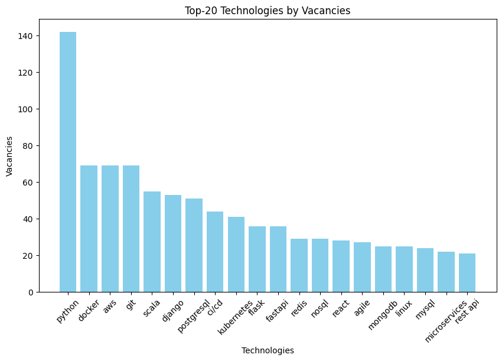
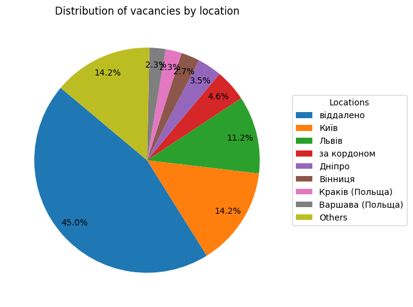
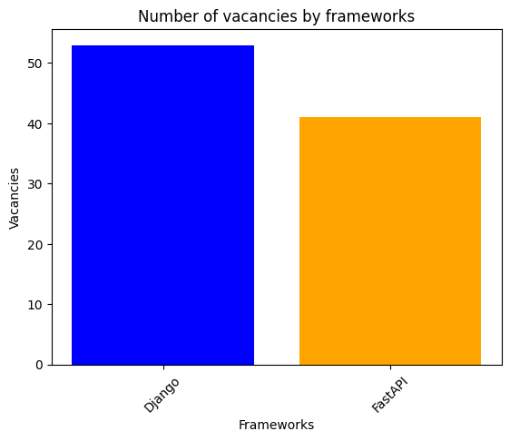
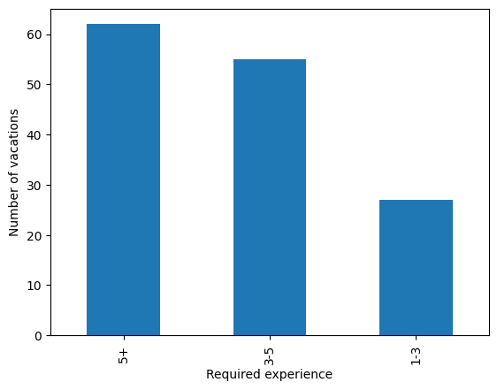

# Scraping and data analysis 📊

<a id="readme-top"></a>


The project collects data from various job search websites and analyzes the obtained information using the ELT cycle. The parser gathers data from DOU and categorizes the collected data by work experience.

## Features:
- Collects data for Python developer vacancies from the DOU website.
- Saves data in a CSV(json/jl etc.) file.
- Each item consists of the following fields: 
  - Company
  - Description
  - Experience
  - Location
  - Salary
  - Technologies
  - Title
- The **Description** field contains the complete data set for the vacancy, allowing for deeper data analysis.
- Simulates a browser using the Selenium library.
- Analyzes data with a user-friendly interface in Jupyter, as well as data processing libraries like Pandas and NumPy.
- Visualizes data using the Matplotlib library and saves graphs in PNG format in the "plots" folder.

## Start the Project

1. Clone repository  
```shell
git clone https://github.com/dimak20/scraping_and_data_analysis_project.git
cd scraping_and_data_analysis_projec
```
2. Then, create and activate .venv environment  
```shell
python -m venv env
```
For Unix system
```shell
source venv/bin/activate
```

For Windows system

```shell
venv\Scripts\activate
```

3. Install requirements.txt by the command below  


```shell
pip install -r requirements.txt
```

4. (Optional) Set stack of technologies you want to consider
```shell
technologies.json
```

5. Start parsing and collect data to csv by the command below
```shell
scrapy crawl dou_spider -O vacancies.csv
```

6. Analyse data in vacancy_analysis.ipynb (or just run It, graphics will be automatically saved in 'plots' directory)
```shell
scrapy crawl dou_spider -O vacancies.csv
```

## Project structure:
- ### plots:
  Stores graphics that were created in vacancy_analysis in .png format
- ### vacancies_scraping:
  The root directory of Scrapy project. The name of this folder is usually the same as the name specified when creating the project. 

- ### vacancies_scraping/spiders:
  This directory contains spider classes, which are responsible for scraping the data from the target website. Each spider is typically defined in its own Python file.

- ### vacancies_scraping/items.py:
  This file defines the data models (items) that will be scraped. Each model is typically a subclass of scrapy.

- ### vacancies_scraping/middlewares.py

- ### vacancies_scraping/pipelines.py

- ### vacancies_scraping/settings.py

- ### requirements.txt

- ### scrapy.cfg

- ### technologies.json:
  Store technologies that may be found in vacancies

- ### vacancies.csv:
  This file contains the primary data collected after parsing job vacancy information from various websites. It serves as the raw dataset used for further analysis and visualization.

- ### vacancy_analysis.ipynb:
  This is the main file where the extraction and preparation of data for analysis takes place. It also performs the analysis of the collected data. Additionally, it saves the generated graphs in the `plots` directory.

<p align="right">(<a href="#readme-top">back to top</a>)</p>

## Graphics











<p align="right">(<a href="#readme-top">back to top</a>)</p>
